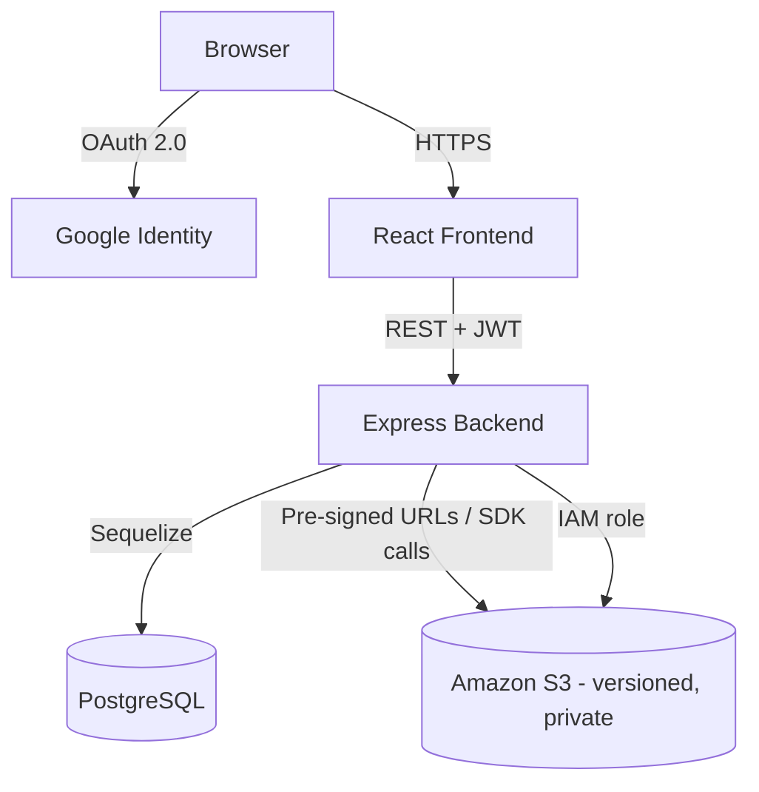

# NimbusDrive — Cloud-Based File Storage System

**CodeTech Cloud Computing Internship — Project 1**

## 1. Internship requirement addressed

This project satisfies the **"Cloud-Based File Storage System"** requirement:
> Build a secure cloud storage application similar to Google Drive, using
> AWS S3, OAuth 2.0 authentication, file versioning, and file sharing.

All four required elements are implemented with real, working integrations
(not mocked): AWS S3, Google OAuth 2.0, native S3 object versioning, and a
token-based file sharing system.

## 2. Features

- **Authentication:** Google OAuth 2.0 sign-in, protected routes, JWT session handling.
- **File management:** upload, download, delete, rename, search, list, folders.
- **Storage:** actual bytes live in S3 (private bucket), never on the app server disk.
- **Versioning:** real S3 object versions — view history, download an older version, restore it.
- **Sharing:** generate revocable share links (permanent or time-limited), share directly with another registered user, view/revoke access.
- **Security:** pre-signed URLs for downloads, owner-scoped authorization on every query, rate limiting, secure headers.

## 3. Technology stack

| Layer | Technology |
|---|---|
| Frontend | React 18, Vite, React Router, Axios |
| Backend | Node.js, Express, Sequelize ORM |
| Database | PostgreSQL |
| Object storage | Amazon S3 (versioned, private, SSE-S3 encrypted) |
| Auth | Passport.js (Google OAuth 2.0 strategy) + JWT |
| CI/CD | GitHub Actions |
| IaC | Terraform |
| Containers | Docker, Docker Compose |

## 4. Architecture



The React app never talks to S3 directly except to *follow* a pre-signed
URL the backend generated — the bucket itself has zero public access.

## 5. Project structure

```
Project-1-Cloud-File-Storage/
├── backend/
│   ├── src/
│   │   ├── config/        # db.js, s3.js, passport.js
│   │   ├── middleware/     # auth.js (JWT), errorHandler.js
│   │   ├── models/         # User, Folder, File, FileVersion, FileShare
│   │   ├── controllers/    # authController, fileController, folderController
│   │   ├── routes/         # auth, files, folders, share
│   │   ├── utils/          # s3Utils.js (all S3 SDK calls live here)
│   │   ├── app.js
│   │   └── server.js
│   ├── migrations/schema.sql   # raw-SQL equivalent of the Sequelize models
│   └── tests/               # Jest + Supertest, S3 calls mocked, real Postgres
├── frontend/
│   └── src/
│       ├── api/client.js    # single Axios client, every endpoint in one place
│       ├── context/AuthContext.jsx
│       ├── pages/           # Login, OAuthCallback, Dashboard, SharedFile, Profile
│       └── components/      # UploadDropzone, FileCard, FolderCard, VersionHistoryModal, ShareModal
├── infrastructure/           # Terraform: S3 + IAM only (see Project 6 for the full 3-tier stack)
├── docs/screenshots/         # capture after deployment — see docs/screenshots/README.md
└── .github/workflows/        # tests.yml, backend.yml, frontend.yml
```

## 6. Local setup

Requires Node.js 20+, npm, and PostgreSQL (or Docker).

```bash
git clone https://github.com/gv2006art/nimbusdrive-cloud-file-storage.git
cd nimbusdrive-cloud-file-storage

# Backend
cd backend
cp .env.example .env      # fill in GOOGLE_CLIENT_ID/SECRET and AWS keys
npm install
npm run dev                # http://localhost:5000

# Frontend (separate terminal)
cd ../frontend
cp .env.example .env
npm install
npm run dev                # http://localhost:5173
```

Or run everything (Postgres + backend + frontend) with Docker Compose:

```bash
cp backend/.env.example backend/.env   # fill in real values first
docker compose up --build
```

## 7. Environment variables

See `backend/.env.example` and `frontend/.env.example` for the full list.
Key ones:

- `GOOGLE_CLIENT_ID` / `GOOGLE_CLIENT_SECRET` / `GOOGLE_CALLBACK_URL` — from Google Cloud Console (see below).
- `AWS_REGION`, `AWS_ACCESS_KEY_ID`, `AWS_SECRET_ACCESS_KEY`, `S3_BUCKET_NAME` — leave the access keys blank when running on EC2 with the IAM role from `infrastructure/iam.tf` attached instead.
- `DATABASE_URL` — full Postgres connection string.
- `JWT_SECRET` — any long random string.

## 8. AWS setup

### 8.1 Create the S3 bucket
Either click through the console or use the provided Terraform:
```bash
cd infrastructure
cp terraform.tfvars.example terraform.tfvars   # set a globally-unique bucket_name
terraform init
terraform plan
terraform apply
```
This creates: a private S3 bucket, versioning enabled, SSE-S3 encryption,
a lifecycle rule to move/expire old versions, CORS for the frontend
origin, and a least-privilege IAM role/policy for the backend.

### 8.2 Enable versioning manually (if not using Terraform)
S3 Console → your bucket → **Properties** → **Bucket Versioning** → **Enable**.

### 8.3 Required IAM permissions
The backend needs (see `infrastructure/iam.tf` for the exact policy):
`s3:PutObject`, `s3:GetObject`, `s3:GetObjectVersion`, `s3:DeleteObject`,
`s3:DeleteObjectVersion`, `s3:ListBucketVersions`, `s3:ListBucket`,
`s3:GetBucketVersioning` — scoped to just this bucket's ARN.

### 8.4 How the backend talks to S3
All S3 SDK calls are centralized in `backend/src/utils/s3Utils.js` using
`@aws-sdk/client-s3` and `@aws-sdk/s3-request-presigner`. Uploads go
through the backend (buffered in memory, never touching disk) and are
`PutObject`'d to S3; downloads are served as pre-signed `GetObject` URLs
the browser hits directly, so file bytes never round-trip through Node
twice.

### 8.5 How files are stored
Each logical file gets a stable S3 key:
`users/<userId>/files/<fileId>/<sanitized-original-name>`. Postgres stores
that key plus metadata (name, size, mime type, current version id);
S3 stores the bytes.

### 8.6 How file versions work
Because the bucket has versioning enabled, uploading to an *existing* key
doesn't overwrite anything — S3 assigns a new `VersionId` and keeps the
old one. The `file_versions` table mirrors this so the UI can list history
without an S3 API round-trip on every page load. Restoring an old version
copies that version's bytes back on top as a brand-new current version
(the standard S3 restore pattern), which itself becomes a new row in the
version history — nothing is ever silently lost.

### 8.7 Google OAuth setup
1. Go to [Google Cloud Console → Credentials](https://console.cloud.google.com/apis/credentials).
2. Create an **OAuth 2.0 Client ID** (type: Web application).
3. Add `http://localhost:5000/api/auth/google/callback` (and your production callback URL) as an authorized redirect URI.
4. Copy the Client ID/Secret into `backend/.env`.

## 9. Deployment

1. Provision infrastructure with Terraform (`infrastructure/`) — S3 bucket + IAM role.
2. Launch an EC2 instance (or Auto Scaling Group) with the IAM instance profile from `infrastructure/outputs.tf` attached; deploy the backend Docker image to it.
3. Point `DATABASE_URL` at your RDS PostgreSQL instance (or self-managed Postgres).
4. Build the frontend (`npm run build`) and sync `dist/` to an S3 static-hosting bucket, fronted by CloudFront.
5. Update `GOOGLE_CALLBACK_URL` and `CLIENT_URL` to the real production domains.

> AWS deployment itself was **not executed** as part of generating this
> repository — no AWS account/credentials were available in this
> environment. The source code, Dockerfiles, and Terraform are prepared
> and ready to deploy; deployment should be performed and verified by you
> against your own AWS account before internship submission.

## 10. CI/CD

Three GitHub Actions workflows:
- **`tests.yml`** — runs on every PR: installs deps, lints, runs the Jest/Vitest suites (against a real Postgres service container), builds the frontend.
- **`backend.yml`** — on push to `main`: re-runs tests, builds the Docker image, then (if AWS secrets are configured) authenticates via **GitHub OIDC** (no long-lived AWS keys in GitHub), pushes to ECR, and triggers an Auto Scaling Group instance refresh.
- **`frontend.yml`** — on push to `main`: builds the Vite app, then syncs `dist/` to S3 and invalidates the CloudFront distribution.

Required repository secrets for deployment: `AWS_DEPLOY_ROLE_ARN`,
`AWS_REGION`, `ECR_REGISTRY`, `ASG_NAME`, `S3_BUCKET`,
`CLOUDFRONT_DISTRIBUTION_ID`. None of these are needed just to run the
`tests.yml` workflow on PRs.

## 11. Testing

```bash
# Backend — requires a reachable Postgres (DATABASE_URL); S3 calls are mocked
cd backend
npm test

# Frontend
cd frontend
npm test
```
The backend suite (13 tests) was run against a real local PostgreSQL
instance while building this repository and passes end-to-end, including
authorization tests that confirm one user cannot read another user's file
by id, and versioning tests that confirm re-uploads create new versions
rather than new files.

## 12. Security

See [`SECURITY.md`](./SECURITY.md) for the full write-up of authentication,
authorization, data protection, and hardening decisions.

## 13. Screenshots

Not included — see [`docs/screenshots/README.md`](./docs/screenshots/README.md)
for the list to capture after you deploy.

## 14. Future improvements

- Bulk upload/download (zip) and drag-to-move between folders.
- Full-text search inside document contents (not just filenames).
- Per-folder sharing instead of per-file only.
- A JWT revocation list for immediate server-side logout.
- Thumbnail generation for images via an S3 event → Lambda pipeline.

## Suggested commit history

```
Initial project setup
Implement authentication
Implement file management
Integrate AWS S3
Implement file versioning
Implement file sharing
Add testing
Add Docker support
Add AWS deployment
Add CI/CD
```

## Author

GitHub: `gv@2006_art`
